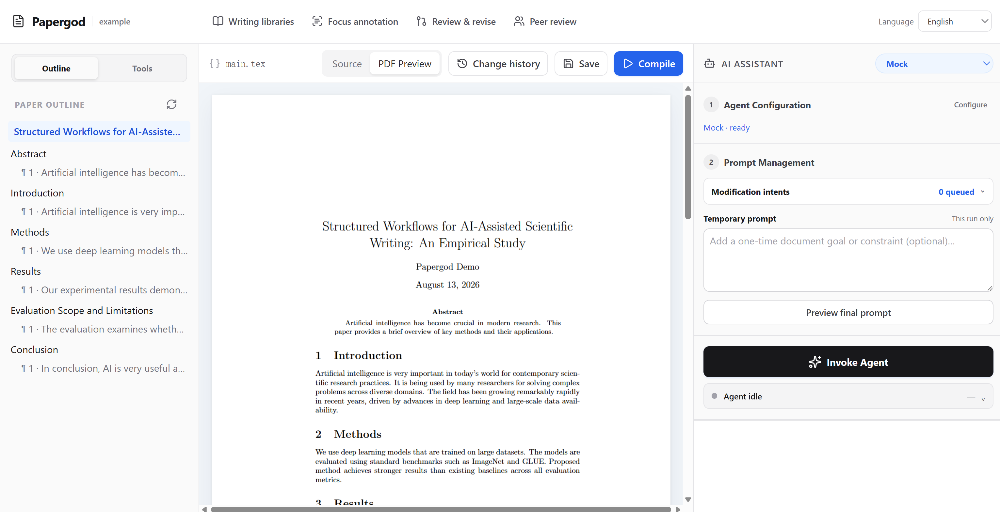

# Papergod

AI-powered LaTeX writing platform — a local-first Overleaf-style editor with safe compilation, structured writing context, and Mock/Codex/Claude Code/OpenCode/Pi Agent assistants.

## Quick Start

```bash
npm install
npm run papergod
```

Open http://127.0.0.1:3000 in your browser.

`npm run papergod` reopens the paper workspace most recently selected in the app. On the very first run, when no workspace has been recorded yet, it falls back to the built-in demo and safely fills its missing demo content. To seed another disposable workspace explicitly, use `papergod ./demo-paper --demo`. Ordinary `papergod ./my-paper` runs add only the non-destructive starter writing library; existing resources are never overwritten.

When installed as a package, run Papergod in any paper directory:

```bash
npx papergod .
npx papergod ./my-paper --port 4312 --agent codex
```

The CLI initializes `main.tex` when the workspace contains no TeX files and stores Papergod metadata in `.papergod/project.json`. Agent choices are `mock`, `codex`, `claude-code`, `opencode`, and `pi`. External providers require an installed and authenticated CLI; Papergod invokes them non-interactively with structured output, timeouts, output limits, and analysis-only permissions.

### Multiple paper workspaces

Open **Tools → Workspaces** to register an existing local folder and switch papers without restarting the server. A folder may be a normal directory or a repository created with `git clone`; Papergod does not take over Git credentials or change the repository workflow, so commit and push with Git as usual. The browser reloads after a successful switch to discard stale PDF and editor state.

**Browse…** first attempts a local operating-system picker (`zenity`, `kdialog`, then Python/Tk on Linux and WSL). If none is available, Papergod automatically opens an in-browser directory navigator rooted at the user's home directory; paths outside that browsing boundary can still be entered explicitly and are validated before use.

**Tools → Terminal** opens a real PTY shell whose working directory is the current paper workspace. It supports ANSI output, interactive input, resizing, scrollback, reconnecting after the dialog is closed, and an explicit stop action. Terminal code is loaded only when the tool is opened, so it does not increase the main workbench JavaScript payload.

The recent-workspace registry is stored in `~/.papergod/workspaces.json`. Paper content, prompts, revision history, writing libraries, and Agent profiles remain isolated in each folder's `.papergod/project.json`. Switching is refused while an Agent task is running, and the current source is saved before a browser-initiated switch. New or existing workspaces receive missing starter checklists, eight academic sentence patterns, and ten precision-focused vocabulary entries by stable ID; user-created entries are preserved.



## Architecture

```
Browser (React workbench + progressive legacy workflow migration)
  │
  │  shadcn-style primitives + CodeMirror editor + structured outline + PDF.js + AI panel
  │
  ▼
Express server (127.0.0.1 only)
  ├── /api/files/*       — read/write .tex files (path-traversal protected)
  ├── /api/compile       — LaTeX compilation (pdflatex/xelatex/lualatex/tectonic)
  ├── /api/engines       — list available LaTeX engines
  ├── /api/agent/*       — scoped AI suggestions + audited CLI runs
  ├── /api/documents/*   — LaTeX structure synchronization + layered prompts
  ├── /api/libraries/*   — corpora, sentence patterns, and scoped vocabulary
  ├── /api/annotations   — range-anchored writing and review comments
  ├── /api/review/*      — atomic review-opinion extraction
  ├── /api/reviews/*     — configurable peer-review panels and synthesis
  ├── /api/revisions/*   — reviewable plans, decisions, apply, and rollback
  ├── /api/generate/*    — prompt/library-controlled full-paper drafts
  ├── /api/workflow/*    — complete history and portable export bundles
  ├── /api/workspaces/*  — local workspace registration and runtime switching
  └── /workspace/*       — static serving of compiled PDFs
```

### Security

- Server binds only to `127.0.0.1` — no network exposure
- All file paths validated against workspace root (path traversal blocked)
- LaTeX compilation uses `execFile` with `shell: false`, shell escape disabled, a 30s timeout, and `SIGKILL` on overrun
- Only `.tex` files can be written or compiled
- Dotfiles denied in static serving
- CodeMirror is installed locally from npm; the editor does not depend on a public CDN

### Agent System

- The assistant is organized into Agent Configuration, assembled Prompt Context, a one-run Temporary Prompt, and the single **请神** invocation button
- **请神** first shows a confirmation dialog, then submits one merged `Prompt Context + Temporary Prompt` instruction to the active Agent
- A compact **Agent Activity** bar below the invocation button shows context preparation, live CLI output, atomic application, PDF compilation, elapsed time, cancellation, and the final result without blocking the paper
- Ordinary Agent suggestions are applied together as one atomic revision instead of requiring repeated Accept clicks; the Agent Activity result can roll that revision back as long as no later source edit would be lost
- **Change history** in Tools keeps the reading view clean while exposing the five most recent applied versions, per-change before/after diffs, source navigation for the current version, and checksum-protected whole-revision rollback
- Agent configuration uses one shared provider shape for Mock, Codex CLI, Claude Code, OpenCode, and Pi Agent; every external adapter supports revision, paragraph drafting, peer review, review orchestration, and full-paper generation
- Papergod detects CLI versions and non-secret authentication readiness with a fast **Check setup** action; actual model validation happens in the ordinary reviewable writing workflow
- Custom CLI paths, prefix arguments, and model overrides are persisted in `.papergod/project.json`, reloaded on later runs, and passed to the real CLI invocation
- Preview the complete invocation context assembled from project/document/element prompts, summaries, sentence intent, selected libraries, temporary instructions, and target source
- **Mock agent**: deterministic suggestions based on pattern matching (passive voice, "very + adjective", short conclusions)
- **CLI agents**: Codex, Claude Code, OpenCode, and Pi Agent run non-interactively with validated structured output, analysis-only execution, timeouts, cancellation, and audit records
- **Provider isolation**: Codex uses a read-only ephemeral execution; OpenCode runs in a temporary directory with permissions denied; Pi runs in JSON mode with tools, sessions, project context, extensions, and skills disabled
- **Structured workflows**: editing, review orchestration, peer review, and full-paper generation each use a dedicated validated JSON protocol
- **Accept/Reject**: both decisions are persisted; accepted edits use atomic revisions and checksum recovery points
- **Element scope**: select a section, paragraph, or sentence from the outline to constrain prompts and diffs to that exact source range

### Structured Writing

- LaTeX sections, paragraphs, and sentences are mapped to stable IDs and exact source ranges
- The outline exposes editable document/element prompts, summaries, and sentence intents
- **Focus Annotation** opens an immersive three-column reader: paper outline on the left, one paragraph and its revision prompt in the center, and sentence-by-sentence reading with intent and prompt fields on the right
- Paragraph and sentence navigation automatically preserves draft annotations; **Open in editor** returns the selected paragraph to CodeMirror
- Sentence-level Agent requests inherit both the parent paragraph prompt and the sentence prompt, so focused annotations become actionable revision context
- Metadata is persisted atomically in `.papergod/project.json`
- Project schema v2 automatically migrates existing schema-v1 review records
- Stale source ranges are rejected before an Agent suggestion can be applied

### Writing Libraries

- Manage algorithm corpora, tagged sentence patterns, citations, and required template slots
- Keep global vocabulary separate from vocabulary agreed for the current writing session
- Select resources explicitly or let Papergod retrieve them by text, tags, and section type
- Generate a reviewable paragraph draft, then insert it only after user confirmation
- Extract candidate expressions from the current paper; candidates require confirmation before entering a library
- Agent runs distinguish resources provided as context from resources the Agent reports actually using

### Review & Revise

- Work through one unified two-stage workspace: **Opinions & plans** followed by **Responses & delivery**
- Anchor a comment to an exact editor selection, or import numbered/bulleted reviewer feedback
- Use Mock or any configured external Agent to split feedback into atomic categorized opinions, exact quotes, suggested fixes, dependencies, and document-node assignments
- Build revision plans with visible before/after text plus dependency and conflict information
- Accept, reject, or defer changes individually; executable changes can also be accepted in a batch
- Apply accepted edits atomically only after explicit review
- Create checksum-protected recovery points and refuse rollback when it would discard later author edits

### Peer Review Panels

- Start from methodology, statistics, writing, domain, and reproducibility reviewer profiles
- Build a custom panel, add reviewer-specific instructions, and edit weighted rubric criteria
- Run reviewers independently through Mock or any configured external Agent with one audited Agent run per report
- Validate exact manuscript quotes and rubric references in every external Agent response
- Synthesize consensus clusters, conflicting assessments, an overall verdict, and prioritized concerns
- Select concerns and send them directly into the reviewable M6 revision workflow

### Responses, Verification & Full-Paper Generation

- Continue from revision planning in the same Review & Revise drawer instead of switching tools
- Turn a revision plan into an editable point-by-point response letter and precise change list
- Apply revisions atomically, recompile the manuscript, and report every unresolved or deferred opinion
- Generate a complete LaTeX draft from project/document prompts, outline and paragraph prompts, plus selected corpora, patterns, and vocabulary
- Preview generated source and accept it only through the same visible revision diff used by ordinary edits
- Record accepted and rejected Agent decisions; accepted suggestions and paragraph insertions receive checksum recovery points
- Browse a unified history of Agent runs, peer reviews, and revisions
- Download source, annotations, reports, revisions, responses, change lists, history, and recovery metadata as a portable JSON bundle

### LaTeX Compilation

- Auto-detects available engines in order: tectonic → pdflatex → xelatex → lualatex
- Opens an available paper directly in the compiled PDF view; LaTeX source remains available as an advanced tool
- Renders compiled PDFs as clean, continuous, width-fitted paper pages without the browser PDF viewer chrome
- Adds a PDF.js text layer: click manuscript text, choose word/sentence/paragraph scope, and save a persistent modification intent without changing the source immediately
- Queued modification intents remain editable/removable, are assembled into one document-level prompt when **请神** is invoked, and are resolved together after one atomic revision; undoing that revision reopens the original intent queue
- Source and rendered pages share one switchable workspace, leaving the assistant column fully available
- Graceful degradation: if no engine found, compile button is disabled but editor works normally
- Compilation errors displayed to the user

## Requirements

- Node.js ≥ 18
- A LaTeX distribution (optional, for compilation): TeX Live, MiKTeX, or Tectonic
- The corresponding provider CLI and login for external Agents. Pi Agent is not bundled; install and authenticate the current `pi` CLI using its official coding-agent documentation before selecting it.

## Testing

```bash
npm test
```

## Project Structure

```
src/server/
  index.js      — Express app + API routes
  security.js   — Path sanitization + security headers
  latex.js      — Engine detection + compilation
  agent.js      — Suggestion store and deterministic Mock agent
  agent-adapters.js — Codex/Claude Code/OpenCode/Pi non-interactive adapters
  project-store.js — Versioned project metadata and validation
  project-resources.js — Corpus, vocabulary, annotation, and revision resources
  latex-structure.js — LaTeX structure/range parser
  document-structure.js — Structure synchronization and metadata APIs
  library-engine.js — Retrieval, scoped vocabulary, template rendering, extraction, and prompt context
  revision-engine.js — Opinion extraction, revision planning, atomic apply, and safe rollback
  review-panel.js — Reviewer profiles, independent reports, synthesis, and revision handoff
  revise-workflow.js — Response letters, verification, full-paper generation, history, and export
public/
  index.html    — Static entry and workflow overlay compatibility layer
  style.css     — Legacy workflow layout styles
  app.js        — Existing workflow and API integration logic
  react/        — Production React bundle generated by Vite
frontend/
  src/components/ — React workbench and shadcn-style UI primitives
  src/theme.css   — White lightweight design tokens and compatibility theme
  vite.config.js  — Production build into public/react
example/
  main.tex      — Sample LaTeX document
tests/
  api.test.js   — Integration tests
```

## Current Scope

- Single-user, local only
- External Agent quality and availability depend on the user's installed/authenticated CLI
- No concurrent editing / CRDT
- No file upload (only pre-existing .tex files in workspace)
- No bibliography / BibTeX support
- PDF-to-source targeting currently matches PDF.js text against parsed manuscript sentences and paragraphs. Complex macros, equations, repeated fragments, and transformed text may not map; SyncTeX-backed coordinate mapping is the planned precision upgrade.
